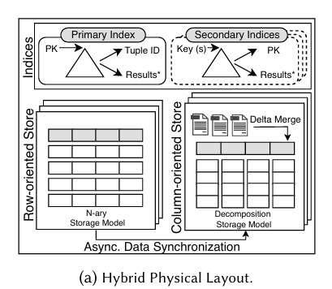
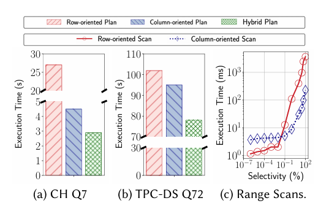

# Rethink Query Optimization in HTAP Databases

<!-- _class: cover_e -->
<!-- _header: "" --> 
<!-- _footer: "" --> 
<!-- _paginate: "" --> 

Haoze Song, Wenchao Zhou, Feifei Li, Xiang Peng, Heming Cui
2023 SIGMOD
汇报人：王思宇 张霆轩

## 背景介绍

<!-- _class: trans -->
<!-- _footer: "" -->
<!-- _paginate: "" -->

### HTAP Databases

<!-- _class: cols-2-73 -->

现代HTAP数据库通常维护两份数据副本来处理混合工作负载：

- 按行存储 --> 适合OLTP
- 按列存储 --> 适合OLAP

基于这种混合存储架构，查询计划可以有三种选择：

- 纯行存储计划
- 纯列存储计划
- **混合计划（hybrid plans）**

本文提出的工作即为对混合计划的全方位改进。

### 混合计划的性能优势

<!-- _class: cols-2-64 -->

混合计划允许单个查询同时从行存储和列存储中获取数据，这样可以发挥两种存储格式的各自优势。比如在星型模式中，维度表适合用主键索引访问，而事实表更适合列扫描。

在不同的查询场景下，混合计划能够：
- 为维度表选择行存储索引访问
- 为事实表选择列存储扫描
- 根据查询特点动态组合最优访问路径

实验结果显示混合计划在多种查询中都能获得显著的性能提升。

### HTAP系统核心组件

系统的核心组件包括：

- **Row Store**: 存储完整的数据行，处理所有写操作
- **Column Store**: 按列组织数据，支持快速的列扫描
- **Delta Store**: 作为缓冲区吸收新的更新，定期合并到列存储
- **异步数据同步机制**: 将行存储的更新传播到列存储

## 过往工作的不足

<!-- _class: trans -->
<!-- _footer: "" -->
<!-- _paginate: "" -->

### 过往查询优化器的不足

传统的查询优化器在设计时并没有充分考虑HTAP数据库的**数据动态性**。

什么是数据动态性？

- OLTP引擎会持续执行写事务
- 不断地将新数据从行存储同步到列存储
- 这种持续的数据更新会影响查询计划的性能

本文提出的**MetisDB**将会解决这个问题：设计一个HTAP感知的查询优化器，能够捕获读操作和写操作之间的相互影响。

### 对HTAP的特性不敏感的Hybrid Plan的问题

传统的HTAP数据库在生成混合计划时存在一个核心问题：

基本上是把列扫描当作一个额外的数据访问路径加到现有的成本模型中，**进而忽略了HTAP环境的特殊性**。

这种做法会导致三个主要问题：

### 1. Data Synchronization的影响

**问题核心：** 在HTAP系统中，列存储需要通过delta store来吸收新的更新。

具体表现：
- 执行列扫描时，系统必须合并delta store和主列存储的数据
- 这个过程需要使用k-way merge算法，带来额外开销

实验发现：
- 随着OLTP并发量增加，列扫描的执行时间会**线性增长**
- 行扫描和列扫描性能相等的选择性阈值会随工作负载变化
- **没有固定的阈值**可以用来做访问路径选择

### 2. Data Freshness的影响

**问题核心：** 由于数据是异步从行存储同步到列存储的，列存储的数据新鲜度总是落后于行存储。

**可见性延迟（visibility delay）问题**：
- 新的更新从在行存储提交到能在列存储中读取之间有时间差
- 在高并发的OLTP工作负载下，延迟可能达到**10秒甚至更长**

性能矛盾：
- 即使列扫描在理论上比行扫描更快，但如果查询必须等待数据同步完成，总响应时间反而可能更长

### 3. Performance Isolation的影响

**问题核心：** 当使用混合计划时，OLAP查询会同时访问行存储和列存储，**打破了原本的性能隔离**。

具体影响：
- 在行存储负载较高时，混合计划会与OLTP事务竞争CPU、内存等资源
- 导致OLTP吞吐量下降多达**58%**
- 混合计划本身的性能也会因为资源竞争而下降

现有解决方案的局限性：
- 传统的配额限制方法（比如限制OLAP只能访问500MB以下的表）太过僵化
- 无法适应不同的工作负载变化

### MetisDB的改进

MetisDB针对这些问题提出了三个关键技术：

1. **Delta-aware的成本模型 Demain** - 精确建模数据访问路径的代价
2. **Visibility-aware的计划选择算法** - 通过预执行掩盖可见性延迟  
3. **Resource-aware的重优化算法** - 保证性能隔离的关键机制

这些技术共同构成了HTAP感知的查询优化器，能够在保持性能隔离的同时充分发挥混合计划的优势。

## 实验评估

<!-- _class: trans -->
<!-- _footer: "" -->
<!-- _paginate: "" -->

### 实验设置与结果

通过实验验证了Metis的有效性：

#### 实验环境
- **硬件**: 7台机器集群，每台机器24核CPU、64GB内存
- **工作负载**: CH-benCHmark、TPC-DS、YCSB三种基准测试

### 核心实验结果

**混合计划的有效性**：
- CH-benCHmark: **40.9%的查询**受益于混合计划，平均获得**1.68倍加速**
- TPC-DS: **77.8%的查询**受益，平均**3.06倍加速**
- 最高加速：Q72查询达到了**11倍加速**

**性能隔离的维护**：
- Metis能够很好地维护OLTP和OLAP之间的性能隔离
- 即使在高负载情况下，OLTP吞吐量下降也控制在**8%以内**
- 而传统方法可能导致**58%的性能下降**

### 关键发现

三个核心技术的不同贡献：

1. **Demain成本模型** - 性能提升的关键
   - 能够纠正传统方法的次优计划选择
   - 次优的计划选择可能导致高达**16.4倍的性能下降**

2. **可见性感知的计划选择** - 进一步性能提升
   - 通过预执行技术掩盖可见性延迟

3. **资源感知的重优化** - 保证性能隔离的关键
   - 即使成本模型完全准确，重优化机制仍然不可或缺
   - 能处理成本模型无法覆盖的资源冲突问题

### 实验结论

Metis成功实现了三个设计目标：
- 在不同HTAP场景下有效利用混合计划
- 保持OLTP和OLAP间强性能隔离  
- 对工作负载变化具有鲁棒性和适应性
